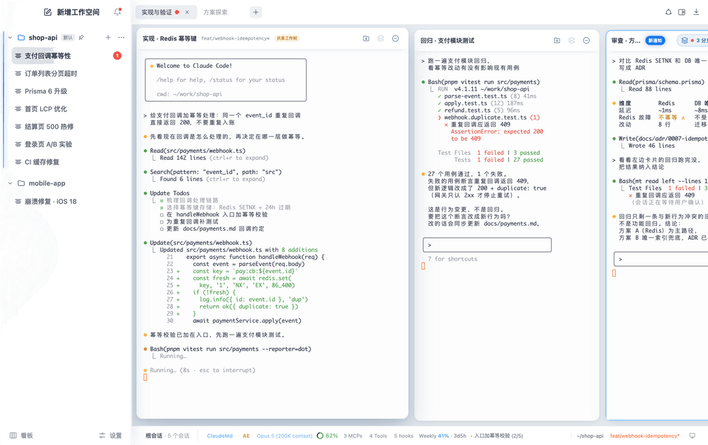

<p align="center">
  
</p>

<h1 align="center">码头 Matou</h1>

<p align="center">
  <strong>Claude Code 多智能体桌面工作台</strong><br>
  A macOS desktop workbench for running many Claude Code agents side by side —<br>
  session management, natural-language collaboration across sessions, DAG visualization, tiered notifications, an agent HUD, and Git worktrees.
</p>

<p align="center">
  <a href="https://github.com/icesword0760/matou/actions/workflows/ci.yml"></a>
  <a href="LICENSE"></a>
  
  
  
  
</p>

<p align="center">
  <a href="#下载安装">下载安装</a> ·
  <a href="#从混乱的终端到可管理的-ai-工作流">核心场景</a> ·
  <a href="#用-dag-看懂会话从哪里来下一步去哪里">DAG 使用方法</a> ·
  <a href="#架构与质量">架构文档</a> ·
  <a href="README.en.md">English</a>
</p>

<br>

码头（Matou）是一款面向 AI 编程的桌面工作台：把 Claude Code 会话、任务、分支和上下文放进同一个可恢复的工作现场。你可以同时推进多个编码智能体，又随时知道每个会话在做什么、需要什么、从哪里分出来。

> **项目状态**：早期预览版，仅支持 macOS（Apple Silicon）。安装包见 [Releases](https://github.com/icesword0760/matou/releases/latest)。



> 上图：一个事项下并行五个 Claude Code。点哪张卡片哪张展开，超出一屏时整排横向滑动；从通知中心点一条「等待输入」，直接跳到出事的那张卡片；最后切到看板看全局。本文截图均来自隔离演示环境，项目、终端输出和通知都是为演示构造的。

---

## 你需要管理的不是终端，而是正在推进的工作

同时开两个 AI 编程会话很轻松，开到十个以后，真正消耗注意力的通常不是代码：

- 这个窗口属于哪个项目、哪个需求、哪个分支？
- 哪个 Claude Code 已完成，哪个在等确认，哪个已经出错？
- 另一个会话刚得出的结论，是否又要复制粘贴一遍？
- 想验证第二种方案，如何保留原会话上下文，又不污染正在工作的目录？
- App 重启后，页签、分屏、目录、输出和 Agent 身份还能否回到原位？

码头把这些问题收进一个工作模型：**工作空间 → 事项 → 画布 → 会话卡片**。你看到的是目标、关系、状态和下一步，而不是一排难以辨认的终端窗口。

## 从混乱的终端到可管理的 AI 工作流

### 1. 用四级结构管理项目、任务和 Agent

| 层级 | 适合放什么 | 你会在什么时候用到 |
|---|---|---|
| **工作空间 Workspace** | 一个代码仓库、产品或客户环境 | 同时维护多个项目时，隔离目录、任务和通知 |
| **事项 Task** | 一项能交付的工作，例如“发布 Matou 0.1” | 按就绪、运行中、阻塞、完成推进工作，而不是寻找窗口 |
| **画布 Canvas** | 一个事项里的阶段或场景 | 把方案探索、实现、回归放到不同页签，减少视觉噪音 |
| **会话卡片 Session** | 一个独立的 Claude Code Agent | 并行编码、审查、测试或调研；每张卡片保留自己的输入、输出和状态 |

事项支持新建、重命名、排序与看板流转；画布支持页签、水平分屏和垂直分屏；会话卡片可以独立运行、聚焦、脱出窗口或回到原画布。

### 2. 直接用自然语言获取其他卡片的信息

当结果在另一张卡片里时，你不必逐个切换、滚动、复制。可以直接对当前 Claude Code 说：

> “看看右边那张卡片的测试跑到哪了，给我结论。”

> “读取父会话最近的输出，对比方案 A 和方案 B 的风险。”

> “让左边的会话继续运行回归，完成后把结果发回来。”

Matou 会向它托管的每个 Agent 提供会话定位与控制能力，使它能够识别自己、列出关联卡片、读取实时屏幕或历史输出、查看可执行命令，并向父卡片、子卡片、左右相邻卡片或指定会话发送输入。这样，跨会话协作仍然发生在你的任务结构里。


> 左侧在实现 Redis 幂等键（运行中），中间的回归测试在等你确认一条断言，右侧的审查会话直接用 `mt read left` 读取了回归结果，再给出结论。

<details>
<summary>当前版本支持的控制命令</summary>

Matou 托管的会话内可使用 `mt identify`、`mt list`、`mt read`、`mt history`、`mt commands`、`mt send` 和 `mt key`。目标可按 `self`、`left`、`right`、`parent`、`child:N`、`sibling:N` 或会话引用指定。

</details>

### 3. 用 DAG 看懂会话从哪里来、下一步去哪里

普通标签页只能告诉你“有哪些会话”，DAG 会话图还能告诉你“它们是什么关系”。当一个问题被拆成多条验证路线时，按 `Option + Tab` 打开独立 DAG：

1. **从当前节点看上下游**：快速定位父会话、当前会话和子会话。
2. **区分两种关系**：实线 Fork 表示继承对话上下文；虚线普通关联表示建立关系但不继承对话。
3. **不打开终端也能判断进展**：节点直接显示 Agent 类型、运行状态、目录、分支、最近输出与子会话数量。
4. **搜索与大图导航**：按名称、路径、分支或输出搜索，配合缩放、平移和自动聚合浏览大规模会话图。
5. **一键回到现场**：点击节点即可关闭 DAG 并聚焦对应会话；已停止节点仍保留在关系图中，方便回看决策链。


> 基线会话 Fork 出方案 A、方案 B 两条路线（实线，继承对话），一个跑回归的 Shell 通过普通关联挂在同一父节点下（虚线）。不打开任何终端就能看到：A 还在跑，B 在等决定，回归以退出码 1 失败。

### 4. AI 通知：只在需要你时打断你

后台 Agent 完成任务、等待输入、请求帮助或发生错误时，Matou 会把信号送到对应会话卡片，并沿画布、事项和工作空间逐级提示。当前正在查看的卡片保持安静；点击通知即可回到产生事件的现场。

通知中心提供事件摘要、来源路径和声音开关，适合同时跑实现、测试、审查等多个 Claude Code 会话时使用。

### 5. AI HUD：不用再问“你现在做到哪了”

底部 HUD 把影响下一步判断的信息放在一个视线范围内：

- 当前模型、权限模式、上下文窗口与已用比例
- 会话持续时间、周期用量和重置时间
- 当前目录、Git 分支、脏状态与工作树环境
- 正在调用的工具、待办进度、运行回归与 MCP 异常


> 通知中心按「工作空间 / 事项」标注来源，出错、等待输入、任务完成分级显示，另一个工作空间的完成事件也会进来；右侧两张卡片带「新通知」角标；底部 HUD 显示当前会话的模型、上下文用量、周用量、待办进度和分支状态。

### 6. Fork + Git Worktree：放心比较多种实现

从已有会话创建 Fork，可以保留父会话，让新会话继承对话后独立继续。需要代码隔离时，为分支绑定 Git Worktree：

- 父会话继续守住稳定实现；
- 子会话分别验证方案 A、方案 B；
- 每条路线拥有清楚的会话关系、目录和 Git 状态；
- 验证完成后，再决定合并、保留或停止。

这适合架构选型、疑难缺陷、多方案 UI、并行代码审查和高风险重构。

### 7. 用看板判断下一步，而不是靠记忆

工作空间看板把事项分为**就绪、运行中、阻塞、完成**。拖动卡片即可更新状态；每张事项卡同时显示会话数量，让你先处理真正需要关注的工作。


### 8. 重启恢复与多窗口：工作现场跟着任务走

Matou 持久化事项、页签、分屏、目录、焦点、终端输出和托管 Agent 的身份。窗口隐藏、应用重启或异常退出后，按不同会话类型恢复现场。会话还可以脱出为独立窗口，再归还原画布；主窗口和独立窗口共享同一 Runtime 会话。

## 路线图

**自然语言创建层级结构（未实现）。** 当前版本已支持用自然语言读取和控制其他卡片；下一步是让你直接描述任务拆分，由 Agent 创建工作空间、事项、画布和会话卡片，而不必连续点击菜单：

> “根据这三个方案创建三个子卡片，分别验证性能、兼容性和回滚路径。”

规划范围包括创建子卡片、兄弟卡片和批量子卡片；聚焦、切换、移除，以及关闭前的预览确认。

**代码签名与公证（未完成）。** 当前安装包未经 Apple 签名，首次打开需要手动放行；Intel Mac 安装包也尚未提供。

## 适合谁

- 同时运行多个 Claude Code 会话的独立开发者
- 希望把 AI coding agent 从“聊天窗口”变成可管理工作流的团队
- 需要 DAG visualization 回溯方案分支、上下文来源和决策路径的复杂项目
- 经常使用 Git Worktree 并行开发、测试、审查和修复的工程师
- 关注会话恢复、通知分级和上下文用量的重度 AI 编程用户

## 下载安装

1. 到 [Releases](https://github.com/icesword0760/matou/releases/latest) 下载最新的 `Matou-<版本>-mac-arm64.dmg`（Apple Silicon）。
2. 打开 DMG，把「码头」拖进「应用程序」。
3. 安装包尚未签名和公证，首次打开时 macOS 会提示无法验证开发者。任选一种方式放行：打开「系统设置 → 隐私与安全性」，在页面底部点击「仍要打开」；或者在终端执行：

```bash
xattr -dr com.apple.quarantine /Applications/码头.app
```

使用前请确认本机已安装并登录 Claude Code CLI。之后有新版本时，应用内会提示更新。

## 从源码运行

### 环境要求

- macOS（目前唯一支持的平台；Linux 和 Windows 未经验证）
- Node.js `>=22.16.0`
- pnpm `10.17.1`（通过 `corepack enable` 启用）
- 已安装并登录的 Claude Code CLI

### 启动

```bash
git clone https://github.com/icesword0760/matou.git
cd matou
corepack enable
pnpm install
pnpm dev
```

`pnpm install` 会自动校正 node-pty macOS 预构建包中 `spawn-helper` 的可执行权限；`pnpm dev` 会先构建 packages 和 runtime，再启动 Electron，首次启动需要几分钟。

## 常用命令

```bash
pnpm test               # 单元与集成测试
pnpm typecheck          # 全工作区类型检查
pnpm build              # 生产构建
pnpm test:e2e           # Electron → Runtime → PTY → xterm 完整链路
pnpm check:identifiers  # 品牌与命名门禁
```

## 项目结构

```text
apps/
├── desktop/              Electron Main、Preload、React Renderer、xterm
└── runtime/              UtilityProcess、PTY、会话、Journal、SQLite

packages/
├── contracts/            跨进程协议与运行时校验
├── domain/               领域类型与不变量
└── ui/                   共享 UI 边界

docs/
├── architecture/         进程、领域、协议与 ADR
├── prd/                  产品需求与交互规格
├── acceptance/           验收记录与运行证据
└── parity/               产品行为对照矩阵

tests/e2e/                真实 Electron 用户旅程
```

## 架构与质量

- Electron Main 创建并监督 app-scoped Runtime UtilityProcess；终端数据通过 `MessageChannelMain` 直达 Renderer。
- Runtime 使用 node-pty 管理 PTY，以 credit window 和累计 ACK 控制输出流量。
- Renderer 只消费可重建投影；会话、层级、持久化和进程生命周期由 Runtime 维护。
- SQLite 保存结构元数据，分段 Journal 保存终端输出与恢复检查点。
- 跨进程协议使用精确版本握手与 Zod schema 校验。
- Renderer 保持 `nodeIntegration: false`、`contextIsolation: true`、`sandbox: true`。

进一步阅读：[进程模型](docs/architecture/process-model.md) · [领域模型](docs/architecture/domain-model.md) · [事件与流协议](docs/architecture/event-and-stream-protocol.md) · [ADR-0001](docs/architecture/adr/0001-app-scoped-utility-process.md)

## 反馈与交流

- 在 [Issues](https://github.com/icesword0760/matou/issues) 提交问题或建议。
- 涉及恢复、分支、通知或多窗口问题时，请附上复现步骤、macOS 版本和可公开的演示数据。
- 加入 QQ 体验反馈群 **454249629**，或扫码：


## 许可证

本项目以 [GNU General Public License v3.0](LICENSE) 发布。你可以自由使用、修改和分发，但基于本项目的衍生作品必须以相同协议开源。

---

如果 Matou 让你少花一点时间寻找终端、确认上下文，欢迎点一个 ⭐。
