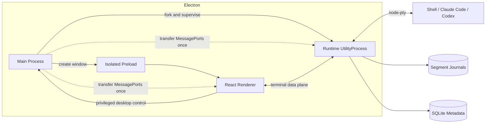
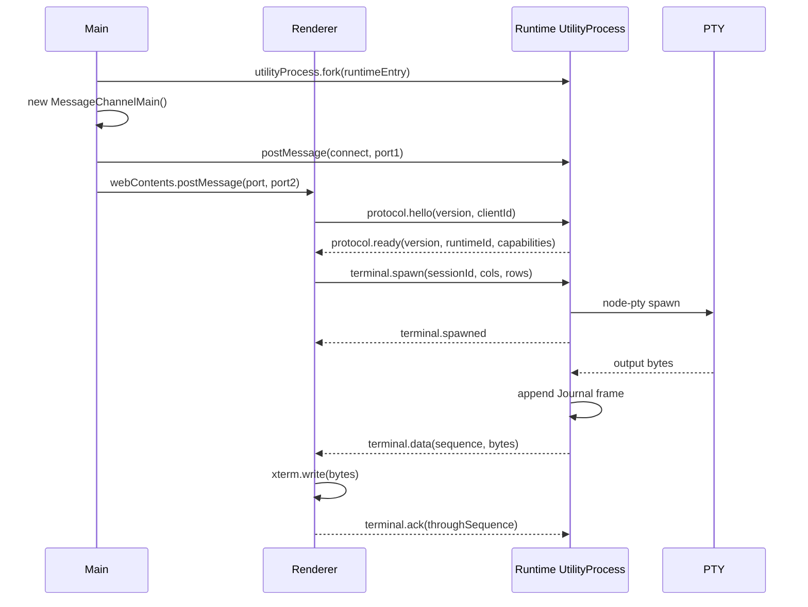

# Matou 进程模型

状态：已定稿  
日期：2026-08-24

## 1. 目标

Matou 是以任务和智能体会话为核心的桌面终端。V1 使用 Electron、React、xterm.js 与 node-pty，并满足以下约束：

1. 高频终端字节不经过 Electron Main 转发。
2. PTY、会话运行状态与 Journal 由独立 Runtime 持有。
3. Renderer 只保存可重建的显示投影，不保存权威任务状态。
4. Runtime V1 随应用生命周期，不承担跨应用版本兼容。
5. Renderer 保持 `nodeIntegration: false`、`contextIsolation: true`、`sandbox: true`。

## 2. 进程与职责



### 2.1 Main Process

Main 负责：

- 应用和窗口生命周期；
- 为主窗口分配跨重启可复现的稳定槽位 ID（`main-window-1`、`main-window-2`…），使事项归位和窗口级焦点可恢复；
- 创建、监控、终止 Runtime UtilityProcess；
- 生成一次性的 Renderer/Runtime 通道并移交端口；
- 原生菜单、系统通知、文件选择器、自动更新等桌面能力；
- 对 Renderer 发起的高权限操作做来源检查和参数校验；
- Runtime 崩溃后的重启与端口重建。

Main 不负责：

- 转发 PTY stdout/stderr；
- 保存 xterm buffer；
- 解释 ANSI/VT 序列；
- 执行 Task、Session、Relation 的领域状态机。

### 2.2 Preload

Preload 是隔离桥接层：

- 接收 Main 移交的 MessagePort；
- 将端口通过受控的 `window.postMessage` 移交到 Renderer main world；
- 暴露少量、具名、参数固定的桌面命令；
- 不暴露 `ipcRenderer`、Node.js、任意 channel 或任意文件系统访问。

### 2.3 Renderer

Renderer 负责：

- React 应用、xterm.js 实例和全部交互界面；
- Workspace、Task、Scene、Session Graph 的只读投影与交互意图；
- 平铺、卡片切换、DAG 三种 Scene Projection；
- 将终端数据写入 xterm 后发送 ACK；
- 重新连接后根据 Runtime 提供的 Checkpoint 与 Journal tail 重建显示。

Renderer 卸载、刷新或崩溃时，Runtime 和 PTY 在 Electron 应用仍存活的前提下继续运行。

### 2.4 Runtime UtilityProcess

Runtime 负责：

- node-pty 创建、输入、resize、信号和退出；
- Workspace、Task、Scene、SessionMount、Session、ExecutionContext、Worktree 的权威运行状态；
- 分段 Journal、Checkpoint 与 SQLite 元数据；
- Claude Code、Codex、通用 Shell 的 Agent Adapter；
- 终端数据序号、客户端 credit、补播和背压；
- 规范化语义事件以及 Artifact/Validation 状态更新。

V1 Runtime 使用 `utilityProcess.fork()`。它随 Electron 应用退出；应用重启时通过元数据和 Journal 恢复显示，并按会话类型选择重新启动 Shell 或恢复 Agent 会话。

四级层级修改全部通过 Runtime RPC 提交。一个命令在同一 SQLite 事务内修改领域实体、窗口焦点和 Outbox 事件；事务提交后再终止被删除的 PTY。工作区移出、事项删除、页签关闭和终端删除因此不会出现「界面已消失但进程仍运行」或「进程先停但层级删除失败」的半完成状态。

## 3. 通道

### 3.1 桌面控制通道

```text
Renderer -> Preload -> Main
```

用于窗口、菜单、通知、文件选择和更新等原生能力。该通道低频、有权限边界，可以使用 Electron IPC。

### 3.2 Terminal Data Plane

```text
Renderer <-> MessagePort <-> Runtime
```

Main 创建 `MessageChannelMain` 后，将两个端口分别交给 Runtime 与 Renderer，随后退出数据链路。一个 Renderer/Runtime 连接使用独立端口；消息以 `sessionId` 多路复用。终端输出使用 `Uint8Array`，按批次发送。

### 3.3 Semantic Event Plane

语义事件使用独立队列，避免被大量终端字节阻塞。V1 可复用同一个 MessagePort，但必须使用不同消息类型和处理队列；若验证发现队头阻塞，则拆为第二个端口，不改变协议语义。

## 4. 建链顺序



Runtime 在成功收到精确版本的 `protocol.hello` 前，不接受 spawn、input 或 resize。

## 5. 生命周期和故障

| 故障 | 行为 |
|---|---|
| Renderer reload | Runtime 保持 PTY；Main 为新 Renderer 建新端口；Renderer 从 Checkpoint/tail 恢复 |
| Renderer 长时间无 ACK | 停止向该订阅者推送；保留 Journal；客户端重连后补播 |
| Journal 写入积压 | 达到全局高水位后暂停对应 PTY 读取，下降到低水位后恢复 |
| Runtime crash | Main 标记运行会话为 interrupted，重启 Runtime，重新读取元数据与 Journal |
| Main crash或应用退出 | Runtime 随应用退出；下次启动执行 revive/resume，而不是连接旧进程 |
| 协议版本不一致 | Main 终止旧 Runtime，启动当前应用内置 Runtime；仍不一致则停止建链并展示升级错误 |
| PTY exit | Runtime 先写入 ExitFrame，再发布 session exited 事件 |

主窗口使用稳定槽位 ID 恢复 `window_navigation` 和 `window_task_placements`。独立终端窗口使用临时 ID；应用重启时 Runtime 将其统一归还所属 Scene，不重开临时窗口。整个事项跨主窗口迁移使用 prepare/ack/rollback，目标窗口确认前 PTY 始终留在 Runtime。

## 6. 安全边界

- Main 只向受信任的顶层 frame 移交端口。
- Runtime 对每条消息执行 schema 校验，并校验 `sessionId` 是否属于当前 connection capability。
- Renderer 不决定 shell 可执行文件；Runtime 根据受控 profile 选择 shell/agent adapter。
- Renderer 发送的 cwd 必须映射到已登记的 ExecutionContext。
- 终端输出视为不可信文本，不作为 HTML 注入 DOM。
- Journal 可能包含密钥和个人数据，默认仅本机可读，并纳入删除与保留策略。

## 7. 性能约束

- Terminal Data Plane 不经过 Main 消息处理函数。
- 每个 session 有独立 credit accounting，同时有 Runtime 全局内存上限。
- 背景 session 允许停止 live projection，通过 Journal 继续运行。
- Terminal data handler 不执行语义解析或 React 状态更新；语义事件由 Agent Adapter 单独产生。
- Renderer 对 resize 做 debounce，避免 PTY resize 风暴。

实现边界：`RuntimeSessionRegistry` 属于 Runtime generation，不属于单个 Renderer 连接；端口关闭只 detach subscriber。`RuntimeHost` 监控 UtilityProcess，异常退出后重启并向仍存活的 Renderer 重新移交 MessagePort。Host Control 在 Unix 使用 0700 目录中的 0600 socket，在 Windows 使用按数据目录派生的稳定 Named Pipe。

## 8. 后续演进触发器

出现以下产品要求时，新增 ADR 评估外部 daemon：

- 关闭 Electron 后 Agent 仍需继续运行；
- 多个 Matou 应用实例共享同一任务；
- 远程 Runtime 或跨设备连接；
- Runtime 需要独立升级或热切换。

外部 daemon 将改用 Unix Domain Socket/Named Pipe，并引入兼容窗口；领域模型和 Journal 格式保持不变。
